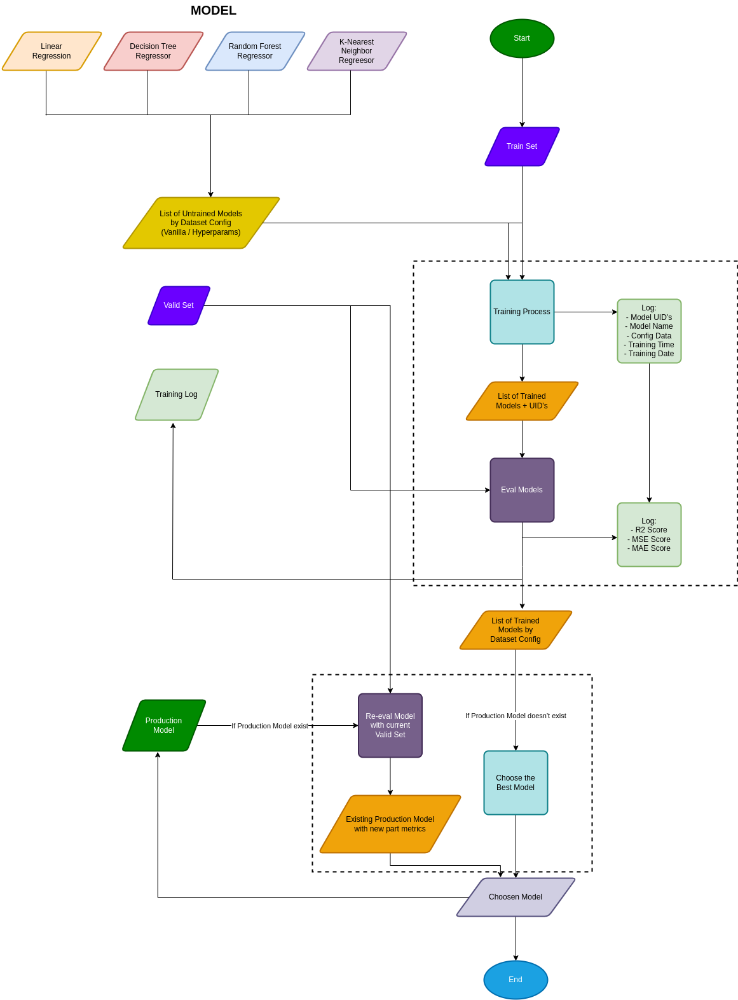

# Machine Learning Process Regression Case

For educational purposes only. 

Goals dari repository ini adalah untuk mempelajari Machine Learning Process dan pipeline nya.

[Dataset](https://www.kaggle.com/datasets/gregorut/videogamesales)

Diagram Flow dari ML Process repository ini

ML Process:
1. Problem Definition
2. Create Data Pipeline
3. EDA Process
4. Preprocessing and Feature Engineering
5. Experiment Modeling
6. Pytest
7. API
8. Deploy to Streamlit
9. Deploy to Docker

Model yang digunakan:
- Linear Regression
- Decision Tree Regressor
- Random Forest Regressor
- K Nearest Neighbor Regressor

TODO:
- [ ] Mencari artikel/referensi yang mengapa jika treat outlier data dengan Log Transform hasilnya `inf` 
- [ ] Kenapa pada `modeling.py` mengapa `X_train` di iterasi
- [ ] Mencari Unit Test apa saja yang umum digunakan
- [ ] Fix API nge bug tidak bisa predict
- [ ] Deploy pake Docker

Tepe